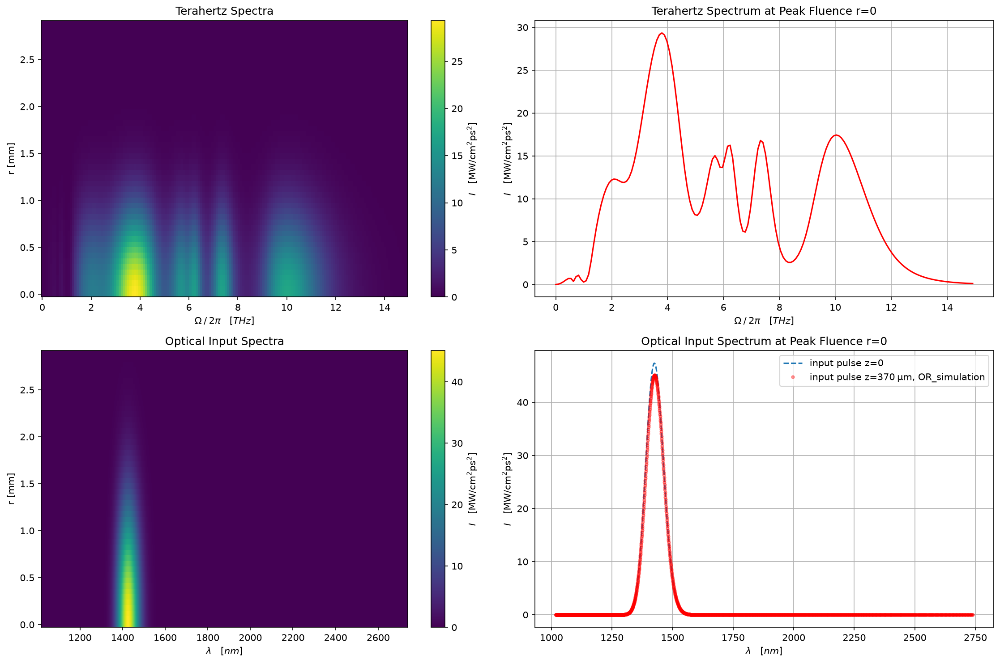

# Optical Rectification

A modular Python solver for nonlinear ultrashort-pulse propagation, used here to model terahertz generation by optical rectification. The solver integrates coupled spectral-domain envelope equations through a dispersive, absorbing nonlinear medium and reports how material dispersion and device geometry set the pump-to-THz conversion efficiency.

**Objective.** Predict how material dispersion, absorption, and pump geometry set the THz conversion efficiency in DSTMS. The model is quasi-3D and includes cascaded optical rectification and three-photon absorption of the near-infrared pump.

## Install and run

```bash
git clone https://github.com/p-engel/nonlinear_optics.git
cd nonlinear_optics/optical_rectification
pip install -e .
```

```python
from optical_rectification import propagator, run, graphs

# pump pulse and spectral grid
model = propagator.ORPropagator(
    t_fwhm=35e-3,       # pulse duration [ps]
    f0=210.4,           # pulse carrier frequency [THz]
    energy=181e-6,      # pulse energy [J]
    b0=2e-3/1.1774,     # beam waist [m]
    Ω_max=2*np.pi*15,   # spectral domain [rad/ps]
    Nw=2**11,           # spectral grid points
    cascade=False,      # cascaded optical rectification on/off
)

result = run.or_simulation(model)   # -> ORSimResult

graphs.ORgraphs(result).spectral_intensity()
```

<p align="center">  </p>

*Output of the snippet above: THz spectrum generated in DSTMS from a 35 fs, 181 µJ pump at 1425 nm. The full four-panel figure, including the radially resolved spectra and the depleted pump, is in [`analysis.ipynb`](analysis.ipynb).*

## Module map

All modules live in `optical_rectification/optical_rectification/`.

| Module | Public class | Responsibility |
| --- | --- | --- |
| `definitions.py` | `Index` | Wavelength-dependent refractive index and absorption for a material, built from tabulated or model data. |
| | `Dispersion` | Derived dispersion quantities — group index, phase mismatch, walk-off — used by the propagator. |
| | `Gaussian` | Input pulse: spectral and temporal envelope from pulse energy, duration, and beam waist. |
| | `Chi2_mixing` | Second-order nonlinear coupling between the optical and THz bands, including the cascading term. |
| `propagator.py` | `ORPropagator` | The propagation model. Assembles pulse, material, and spectral grid, and exposes the physics switches (e.g. `cascade`). |
| `observable.py` | `Observable` | Physical quantities extracted from a propagated field — energies, conversion efficiency, spectra. |
| `run.py` | `or_simulation`, `ORSimResult` | Executes the propagation for a given model and returns the fields and observables as a result object. |
| `graphs.py` | `ORgraphs` | Plotting for fields, spectra, and efficiency scans. |
| `par.py` | — | Physical constants and default simulation parameters. |

The split is deliberate: material properties, pulse definition, and nonlinear coupling are independent objects handed to the propagator, so swapping a material or a mixing model does not touch the integrator.

## Tests

```bash
pytest
```

Ten test files covering the numerics and the physics: `test_index`, `test_dispersion`, `test_gaussian`, `test_chi2mixing`, `test_propagator`, `test_observable`, `test_run`, `test_spectrum`, `test_corr`, `test_lorentzpdf`. The propagator and observable tests check conserved quantities and known analytic limits rather than just exercising the call signatures.
